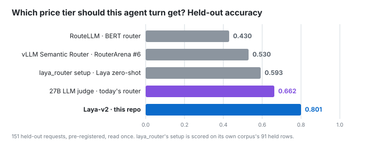

# Laya-v2: routing AI agent turns with a 421M System-One model

**A fine-tuned open encoder that picks the right price tier for each agent turn.** It is more accurate than a 27B
LLM judge, vLLM Semantic Router and RouteLLM on held-out data. It decides in one forward pass, with zero generated
tokens, in about 125 ms on a consumer GPU.

[](LICENSE)
[](https://github.com/mdad-elec/laya-v2-agent-routing/releases/tag/v1)
[](results/PREREG.md)
[](video/laya-v2-vs-judge-workbench.mp4)



## Results

Held out, pre-registered, read once. Quality is the graded score of the answer the routed model gave, on 60 asks
answered by 23 model × effort cells.

| router | band accuracy (151 requests) | answer quality | median cost per turn | decision tokens |
|---|---|---|---|---|
| **Laya-v2 (this repo)** | **0.801** | **0.944** | 218 µUSD | **0** |
| 27B LLM judge | 0.662 (p = 0.003) | 0.887 | 220 µUSD | 57 |
| vLLM Semantic Router, RouterArena #6 | 0.530 (p < 1e-8) | 0.888 | 576 µUSD | 0 |
| RouteLLM, BERT router | 0.430 (p < 1e-9) | 0.842 | 148 µUSD | 0 |

p-values are one-sided exact McNemar tests against Laya-v2 on the same rows. On
[glukicov/laya_router](https://github.com/glukicov/laya_router)'s own corpus, Laya-v2 scores 0.857 on the held rows,
against 0.593 for that project's zero-shot setup.

## What we found

- **Three serving defects hid Laya's ability.** The wrong checkpoint was served, the brain saw a wrapped state instead
  of the bare request, and the options reached the wire in alphabetical order because JSON maps are sorted. Fixing
  them is worth 7 points before any training. See `report/report.md` §4.
- **A short fine-tune does the rest.** RLCD on 119 labelled requests plus 708 filtered paraphrases takes about 80 s an
  epoch on an RTX 2080 Ti.
- **Subject and preference signals don't predict cost tier.** vLLM Semantic Router routes by subject and RouteLLM by
  GPT-4-vs-Mixtral preference, and both miss this task.
- **Effort barely changes correctness.** The lowest reasoning effort was within 0.05 of a model's best on 112 of
  120 asks.

**Where it does not win.** On RouterBench's "which model solves this" task, RouteLLM is slightly ahead, and Laya-v2
stays below the single-model baseline. On our own 60 asks, its band accuracy ties the judge. A Laya-verified cascade
failed: the verifier can't judge answer correctness. A perfect verifier would still cut cost by about two thirds.
Details: `results/VERDICT.md`, `results/cascade.md`.

## Use it

```bash
gh release download v1 -R mdad-elec/laya-v2-agent-routing -D model      # model.safetensors, sha256 6098ad76…
PYTHONPATH=<laya repo> python benchmark/run.py --backend laya --checkpoint model --output /tmp/run
python benchmark/audit.py --run-dir /tmp/run
```

Read Laya-v2's benchmark numbers on the `held` split; it was trained on `tune`.

## What's inside

| path | contents |
|---|---|
| `report/` | the technical report (`report.md`, and `index.html` as one page) with figures |
| `results/` | pre-registration with five amendments, the verdict, and every comparison |
| `dataset/` | cases, per-cell graded outcomes, router decisions, frozen splits, checksums |
| `benchmark/` | a runnable 117-case benchmark with frozen results for three routers |
| `finetune/`, `model/` | the training code, 708 paraphrases, and the checkpoint's card and config |
| `eval/` | the instruments: statistics, replays, the RouteLLM / vLLM-SR / RouterBench / cascade benches |
| `video/` | the side-by-side take on real seats (two private asks cut) |

## Limits

- Labels come from one annotator. The answer-grading panel isn't human-calibrated.
- The held sets have 151 and 60 rows, so each number carries about ±0.06.
- It was measured on one estate's model menu, in English.
- vLLM Semantic Router ran as RouterArena's adapter uses it. The leaderboard entry's unpublished extra signals were
  not reproduced.

## Credits

Built on [Laya](https://huggingface.co/convaiinnovations/laya) (Apache-2.0). 180 requests come from
[glukicov/laya_router](https://github.com/glukicov/laya_router); see `ATTRIBUTION.md`. The routing policy follows
[jev-router](https://github.com/gargpratyush/jev-router). Related work: RouteLLM
([2406.18665](https://arxiv.org/abs/2406.18665)), RouterBench ([2403.12031](https://arxiv.org/abs/2403.12031)),
[RouterArena](https://github.com/RouteWorks/RouterArena), [vLLM Semantic Router](https://github.com/vllm-project/semantic-router),
[NeMo Switchyard](https://github.com/NVIDIA-NeMo/Switchyard). License: Apache-2.0.
