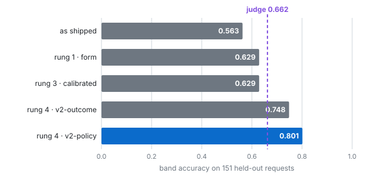
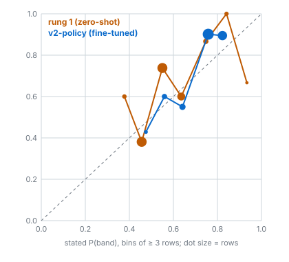
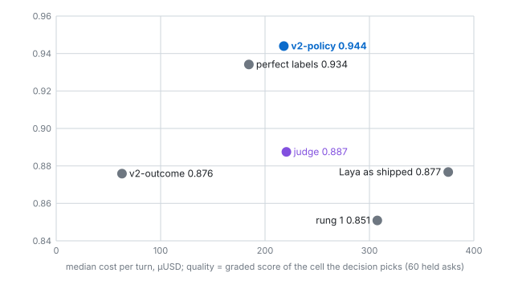
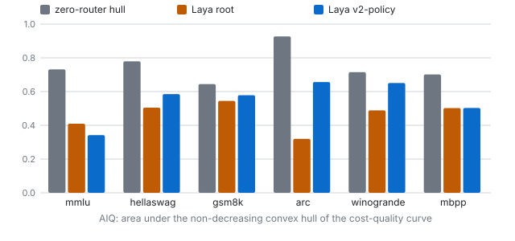

# Routing an AI agent's turn with a System-One model: Laya-v2 against an LLM judge

*DSI dss-platform — 2026-09-24. Branch `feat/router-laya-ab`. Pre-registration: `scripts/laya/PREREG.md`. Every number below
is read from a file under `scripts/ab/results/`; the file is named beside it.*

## Abstract

An agent platform routes each turn of an agent to a model and a reasoning effort. Today's router asks a 27B model for a JSON
verdict (p_solve, capability boundary) before every turn. We asked whether an open **System-One** decision model — Laya, a
421M ModernBERT-large encoder that answers a typed question in one forward pass with no generated tokens — can make that
decision better. A first live A/B said no: Laya lost to the judge. We found three defects of ours in every number of that
A/B (the wrong checkpoint served, a wrapped state shown to the brain, and the options posted in alphabetical order), fixed
them, and climbed a pre-registered four-rung ladder, each rung read once on a frozen held-out split. Zero-shot fixes
recover 6.6 points (0.563 → 0.629 band accuracy) but still trail the judge (0.662). A fine-tune of Laya on the tune split's 119
policy-labelled requests plus 708 filtered paraphrases reaches **0.801** — **+0.139 over the judge, exact McNemar p = 0.0027** — and, replayed
over 2,760 graded answers from 23 (model × effort) cells, raises answer quality from 0.887 to **0.944** (90% CI of the
difference [+0.016, +0.100]) at the same median cost, with no generated decision tokens. The band-accuracy margin comes from the borrowed tier rows; on this estate's own asks the two tie on band accuracy, and Laya-v2 wins on quality because it underspends less. Two findings go the other way: the
effort question is useless on these asks (the lowest effort suffices on 112 of 120), and the fine-tuned router does not
transfer to RouterBench, whose label is "which model solved it", not "which tier the policy wants".

## 1. Setting

- **The platform's menu.** 8 models, 23 measured (model × effort) cells: Claude Opus 5 / Fable 5 / Sonnet 5 at low, high and
  max effort; Codex GPT-6-astra, GPT-5.6-sol / terra / luna at their lowest, high and max; a local Qwen 3.8 27B with thinking
  off and on (`results/20260924-cells-120/report.md`).
- **The decision.** A price band (`small / medium / powerful`) for the turn; a measured cell frontier then picks the cell
  (spec `docs/superpowers/specs/2026-09-23-dss-auto-effort-cells-design.md`).
- **The incumbent.** `CLASSIFIER_PROMPT` on the local 27B, JSON verdict mapped to two tiers by a threshold rule; for a fair
  three-way comparison a one-parameter adapter splits the efficient tier, its threshold fitted on tune (`judge-adapter.json`,
  t_small = 0.96).
- **The challenger.** Laya (convaiinnovations/laya, Apache-2.0), asked one `choice` question whose option descriptions are
  the prompt.

## 2. Related work

RouterBench (Hu et al., [arXiv 2403.12031](https://arxiv.org/abs/2403.12031)) evaluates routers on precomputed outcomes on a
cost-quality plane and defines AIQ; we use both. RouteLLM (Ong et al., [arXiv 2406.18665](https://arxiv.org/abs/2406.18665))
learns strong/weak routers from preference data. FrugalGPT (Chen et al., [arXiv 2305.05176](https://arxiv.org/abs/2305.05176))
cascades models; Hybrid LLM (Ding et al., [arXiv 2404.14618](https://arxiv.org/abs/2404.14618)) routes by predicted difficulty
between an edge and a cloud model. System-One decision models (TypeSafe's hosted Jev; the open Laya and its RLCD fine-tuning
recipe) answer typed questions in one pass; `glukicov/laya_router` measured Laya as a three-tier router (0.600 on 180
requests) — our harness reproduces their numbers to three decimals (`scripts/ab/corpus/ATTRIBUTION.md`).

## 3. Method

**Corpora.** 240 tier-labelled requests (180 borrowed, 60 our own, unaudited and never in a headline), and a pilot of 120
checkable asks (48 + 72 drafted from the written band policy and validated in code: every gold passes its check, every
python/sql check has a plausible wrong answer that must fail, no near duplicates, no private terms — `validate_corpus.py`).
**Splits are frozen files** (`scripts/ab/corpus/splits/`): the day the corpus grew, the old run-time draw would have moved
held-out asks into tuning.

**Pre-registration** (`scripts/laya/PREREG.md`, written before any measurement). H1: band accuracy − judge ≥ 0.05 and
one-sided exact McNemar p < 0.05. H2: answer quality on the same menu, non-inferior (−0.02, 90% bootstrap CI > −0.05).
H3 decision latency, H4 cost, H5 off-local rate, H6 an effort question. One held-out read per rung, ledgered
(`results/laya-v2/heldout-ledger.md`). Two amendments, both before the thing they govern was measured (H6's bar; the
serving form after rung 1).

**Quality without new calls.** Every pilot ask was answered by all 23 cells and graded — machine checks where the ask has
one, else a blind cross-family panel. A decider's quality on a menu is the graded score of the cell the menu resolves its
band to (the RouterBench method); a Python port of the gateway's cell chooser, proven to reproduce the gateway's own picks,
supplies the menus (`scripts/ab/menu.py`).

## 4. The three defects

| defect | how it was found | cost (held band accuracy) |
|---|---|---|
| The sidecar served `typed-decisions`; the measured decision was the root | `/health` on the Spark; `lib-arm.sh` default | — |
| The router showed the brain its session and every servable rung name | captured the bytes off the wire (`LAYA_CAPTURE_PATH`, `fixtures/wire-state.json`) | root: 0.711 bare vs 0.342 wrapped on tune |
| The options went out `medium, powerful, small` | the capture; `serde_json` without `preserve_order` sorts every `Value` map — and the event store's JSONB sorts too | inside Ship 0's 8-point order effect |

Together: 0.563 as shipped → 0.629 fixed (`r1-held.md`). The fixes are now invariants in code: the schema is an ordered
content type stored as arrays, validated at admission; the brain sees `{"request": …}`; the record pins the weights' sha256
and the probe refuses a different — or unreported — checkpoint (`scripts/e2e/h8-router-laya-v2.sh`).

## 5. The ladder

| rung | change | tune | held band accuracy | adopted? |
|---|---|---|---|---|
| — | as shipped | 0.557 | 0.563 | — |
| R1 | root, bare state, example-led, measured order | 0.711 | 0.629 | yes |
| R2 | 49 wordings × orders × instructions × keys; 5-question schema; logistic combiner | 0.711 (same config) | — (unchanged, not re-read) | no improvement |
| R3 | temperature 1.76 → 1.10 | ECE 0.150 → 0.071 | 0.629, ECE 0.122 → 0.112 | no (bar 0.08) |
| **R4** | **RLCD fine-tune (v2-policy)** | val 0.821 | **0.801** | **yes** |
| R4 | fine-tune on 0.5 label + 0.5 measured outcome (v2-outcome) | val 0.821 | 0.748 | second variant |

(`r1-report.md`, `r2-report.md`, `r3-report.md`, `r4-report.md`.) The zero-shot fixes close a third of the distance to the
judge; the fine-tune is what passes it — as upstream's card says, Laya is "a fast base to specialise, not a zero-shot
decision engine". Training took ~80 s an epoch on an RTX 2080 Ti.

## 6. Results against the pre-registration (`results/laya-v2/VERDICT.md`)

| | judge | Laya-v2-policy | |
|---|---|---|---|
| **H1** held band accuracy (151) | 0.662 | **0.801** | +0.139, McNemar 37 vs 16, p = 0.0027 — **met** |
| underspend / overspend | — | 0.119 / 0.079 | rung 1: 0.238 / 0.132 |
| **H2** quality, arm C's cell menu (60) | 0.887 | **0.944** | CI [+0.016, +0.100] — **met, superior** |
| **H2** quality, models-only ladder (60) | 0.813 | **0.838** | CI [+0.005, +0.046] — **met, superior** |
| cost p50 per turn (cell menu) | 220 µUSD | 218 µUSD | same |
| **H4** decision tokens | 57 out + 180 in | 0 out + ~120 in | **met** |
| decision latency | p50 2.3 s / p95 3.8 s (27B, GPU) | p50 0.59 s / p95 0.82 s (CPU, contended) | **H3 on the Spark not measured** |
| **H6** effort question | — | — | **dropped**: constant `minimal` is 0.917 |

**Where H1's margin lives.** Split by corpus, the held read is 0.857 against 0.637 on the 91 borrowed tier rows (26 vs 6 discordant, p = 0.0005), and 0.717 against 0.700 on the 60 pilot asks (11 vs 10, not shown apart). H1 was pre-registered on the pooled 151 and is met there; on this estate's own asks Laya-v2 ties the judge on band accuracy. It still wins on quality there (H2), because the judge's errors are mostly underspends (15 of 60, against Laya-v2's 9; overspends 3 against 8), and an underspend costs the answer.

Perfect band labels score 0.934 on the cell menu; the best graded cell per ask 0.998. Laya-v2 is at the label ceiling, and
the remaining distance to the oracle is the menu's, not the decider's.

## 7. What went the other way

- **Effort barely matters for correctness here.** For a given model, the lowest measured effort is within 0.05 of that
  model's best on 112 of 120 asks (`effort_labels.py`). Effort is a time-and-cost lever; the cell frontier already prices it.
- **The menu measured on 120 asks, under the spec's default weights, collapses to the models-only ladder** — `medium` goes to
  the local 27B with thinking off (0.67 quality on medium asks) because time and cost carry 60% of the weight. That is a
  policy-weight finding for the owner, not a router defect.
- **RouterBench.** On 2,451 test prompts of six tasks neither zero-shot nor fine-tuned Laya reaches the hull of the eleven
  single models (AIQ 0.34–0.66 against 0.64–0.93, `routerbench.md`). Laya-v2 learned a spending policy; RouterBench's label
  is solvability. A RouterBench router would be trained on its own 70%, as the paper's are.

- **Answer quality alone rewards overspend.** Sending everything to the strongest cell beats perfect labels on quality;
  every quality number here is printed beside its cost.

## 8. Limitations

One annotator's policy labels (blind ceiling ~0.82 on the borrowed rows; Laya-v2 sits at 0.801). The panel is not yet
human-calibrated (the blind audit slice is prepared, not graded). 151 and 60 held rows: ±0.06–0.08. One estate's menu,
English only, list prices on subscription seats. The 60 DSS-domain labels are unaudited and excluded from every headline. Two held pilot asks are private, so a reproduction from the public dataset has 149 H1 rows and 58 H2 asks.
Decision latency on the Spark's GPU was not re-measured for the fine-tune; on an RTX 2080 Ti workstation's GPU, shared with a rendering service, it was p50 125 ms and p95 150 ms over the LAN (20 decisions). In a long conversation the gateway's session hold keeps a cheap cell after Laya names `powerful`; the replay scores fresh sessions and does not see it.

## 9. Reproduce

Corpus, splits, pre-registration and every script are in the repository; the run directories are named in each report.
`python3 -m unittest discover -s scripts/ab` and `scripts/laya` run the instruments' tests; `scripts/e2e/h6/h7/h8` the
platform's. The public package — cases, measured outcomes, the fine-tuned checkpoint and a model-free audit — is prepared
for Hugging Face (`scripts/publish/`) and for Laya's community benchmarks (`research/benchmarks/agent_routing/`).
